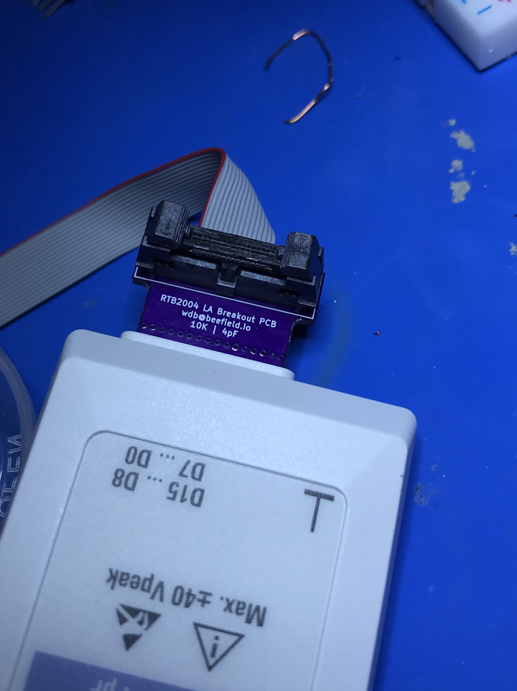
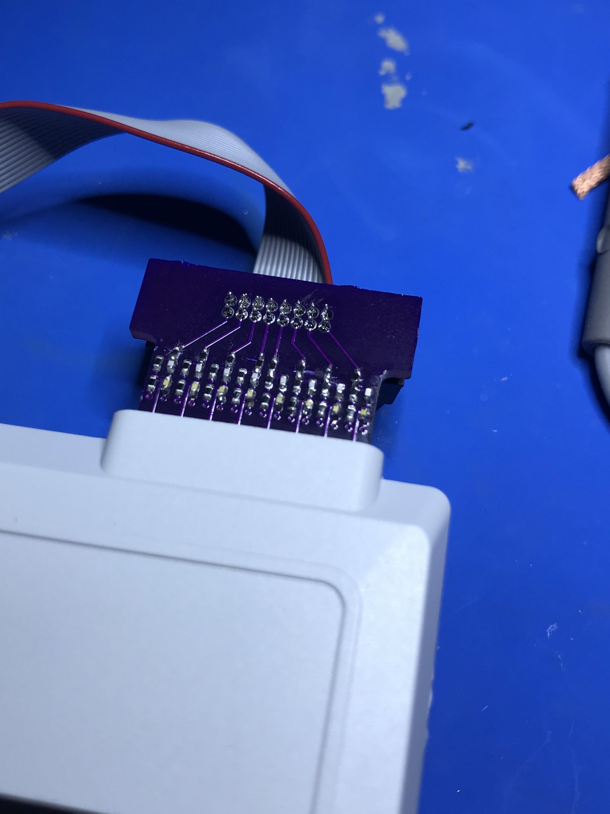

# RTB2004 Logic Analyzer Adaptor 
A basic PCB to convert the RTB2004 LA pods into a 0.05" pitch pin header instead of flying leads. Resistor network is for 10k input impedance. To plug into the LA pod a standard 0.1" pitch header solders edgwise on to the exposed pads on the PCB. 

# Photos 
## Front 

## Back 

